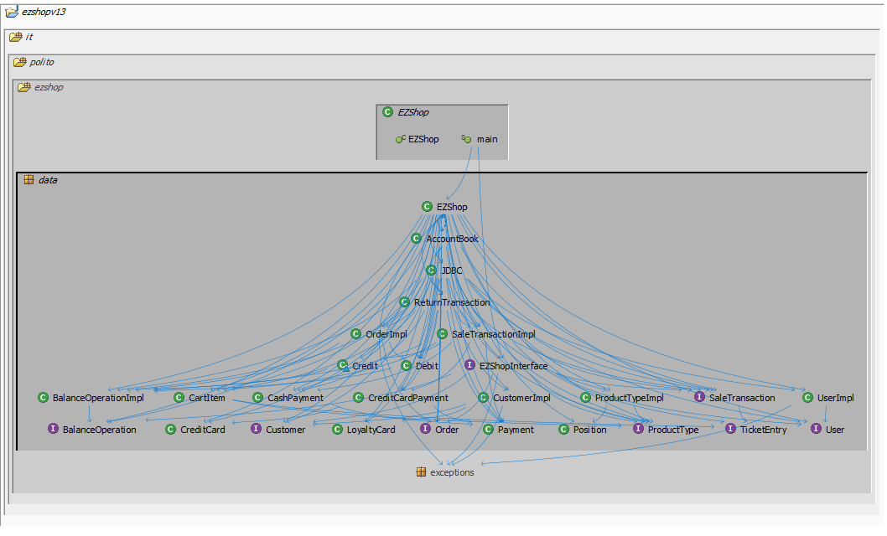
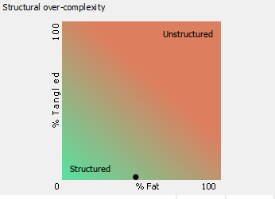
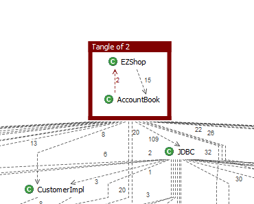

# Design assessment


```
<The goal of this document is to analyse the structure of your project, compare it with the design delivered
on April 30, discuss whether the design could be improved>
```

# Levelized structure map
```
<Applying Structure 101 to your project, version to be delivered on june 4, produce the Levelized structure map,
with all elements explosed, all dependencies, NO tangles; and report it here as a picture>
```



# Structural over complexity chart
```
<Applying Structure 101 to your project, version to be delivered on june 4, produce the structural over complexity chart; and report it here as a picture>
```



# Size metrics

```
<Report here the metrics about the size of your project, collected using Structure 101>
```


| Metric                                    | Measure |
| ----------------------------------------- | ------- |
| Packages                                  |   5     |
| Classes (outer)                           |   47    |
| Classes (all)                             |   47    |
| NI (number of bytecode instructions)      |  9811   |
| LOC (non comment non blank lines of code) |  ~4219  |


# Items with XS

```
<Report here information about code tangles and fat packages>
```

| Item | Tangled | Fat  | Size | XS   |
| ---- | ------- | ---- | ---- | ---- |
|ezshop.it.polito.ezshop.data.EZShop|   -      |  190    | 4769     | 1757     |
| ezshop.it.polito.ezshop.data.EZShop.modifyCustomer|    -     |   20   | 327     |  81    |


# Package level tangles

```
<Report screen captures of the package-level tangles by opening the items in the "composition perspective" 
(double click on the tangle from the Views->Complexity page)>

```
##### We have 0 package-level tangles. The only one we notice is a class-level tangle between EzShop and AccountBook. We report this screen here.

### N.B. THIS IS A CLASS TANGLE!!!, NOT A PACKAGE ONE



# Summary analysis
```
<Discuss here main differences of the current structure of your project vs the design delivered on April 30>
<Discuss if the current structure shows weaknesses that should be fixed>
```
If we compare Structure 101 design with the design delivered on April 30, we can notice little differences.

First of all, in our design Interfaces and Database classes are missing. This is due to the fact that we developed the low level design without having the information about Interfaces that will be used (same for DB).
Furthermore, we notice some additional relations between ezshop and unit classes (such as Position or CartItem). This is missing in our design because we have assumed that EzShop is able to reach these classes in an implicit way and also to avoid pointless loops.

We have no package-tangles and just a class tangle (caused by the db interaction) and we can conclude that **there aren't dangerous weaknesses** that need to be fixed.
