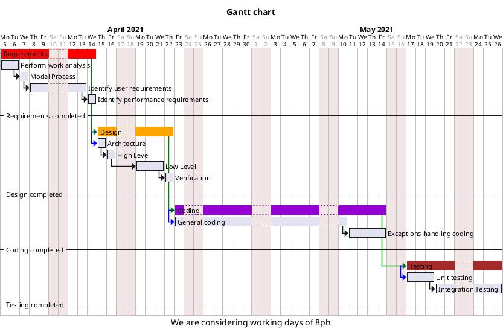

# Project Estimation  
Authors: Rocco Luca Iamello, Massimo Di Natale, Paolo Trungadi, Riccardo Gracis

Date: 28/04/2021

Version: 1.10
# Contents
- [Estimate by product decomposition]
- [Estimate by activity decomposition ]
# Estimation approach
<Consider the EZGas  project as described in YOUR requirement document, assume that you are going to develop the project INDEPENDENT of the deadlines of the course>
# Estimate by product decomposition
### 
|             | Estimate                        |             
| ----------- | ------------------------------- |  
| NC =  Estimated number of classes to be developed   |        15                   |             
|  A = Estimated average size per class, in LOC       |         200 LOC                  | 
| S = Estimated size of project, in LOC (= NC * A) |  3000 LOC|
| E = Estimated effort, in person hours (here use productivity 10 LOC per person hour)  |       300 ph         |   
| C = Estimated cost, in euro (here use 1 person hour cost = 30 euro) | 9000€ | 
| Estimated calendar time, in calendar weeks (Assume team of 4 people, 8 hours per day, 5 days per week ) |  ~2 calendar weeks (1,87 rounded up)      |               
# Estimate by activity decomposition
### 
|         Activity name    | Estimated effort (person hours)   |             
| ----------- | ------------------------------- | 
|  **Requirements**  | |
| Perform work analysis | 16 |
| Model Process | 6 |
| Identify user requirements  | 32 |
| Identify performance requirements | 6 |
| _Sub-total Requirements_ | _60_ |
| **Design** |  |
| Architecture | 8 |
| High level design | 8 |
| Low level design | 24 |
| Verification | 8 |
| _Sub-total Design_ | _48_ |
| **Coding** |  |
| General coding | 96 |
| Exceptions handling coding | 32 |
| _Sub-total Coding_ | _128_ |
| **Testing** |  |
| Unit Testing | 24 |
| Integration Testing | 40 |
| _Sub-total Testing_ | _64_ |
|  |  |
| **TOTAL** | **300** |

###
Insert here Gantt chart with above activities

