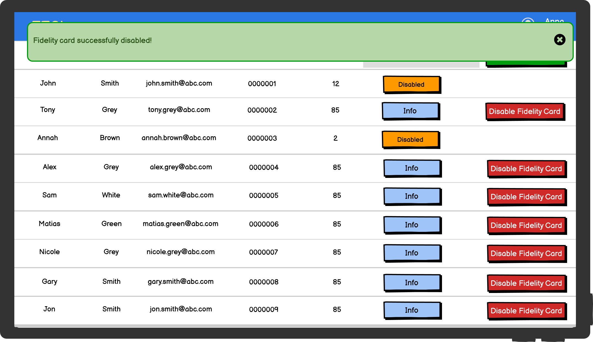

# Graphical User Interface Prototype  

Authors:Rocco Luca Iamello, Massimo Di Natale, Paolo Trungadi, Riccardo Gracis

Date: 19/04/2021

Version: 1.10

Since our SW Product is suitable for different devices (PCs, Tablets, All-in-one desktop for cash desk), we report different sketches for different devices in order to give a general view of EZShop's usage.

### Use Case 1, UC1 - Manage sales and payment 

### Use case 2, UC2 - Add item in the inventory

### Use case 3, UC3 - Modify item in the inventory

### Use case 4, UC4 - Remove item from the inventory

### Use case 5, UC5 - Retrieve item info

## Scenario 5.1 - Search by code result

## Scenario 5.2 - Search by category results

### Use case 6, UC6 Creating a new Employee Account

### Use case 7, UC7 Deleting an existing Employee account

### Use case 8, UC8 - Modifying an existing Employee account

### Use case 9, UC9 - Add new fidelity card

### Use case 10, UC10 - Disable fidelity card AND Use case 11, UC11 - Find card balance

### Use case 12, UC12 - Perform Analysis

### Use case 13, UC13 Managing accounting

