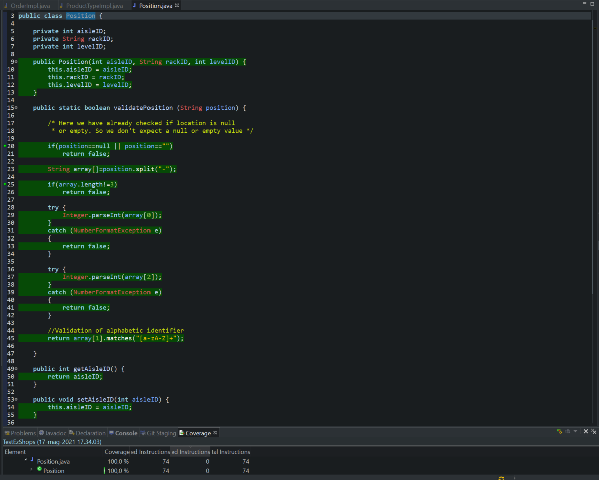
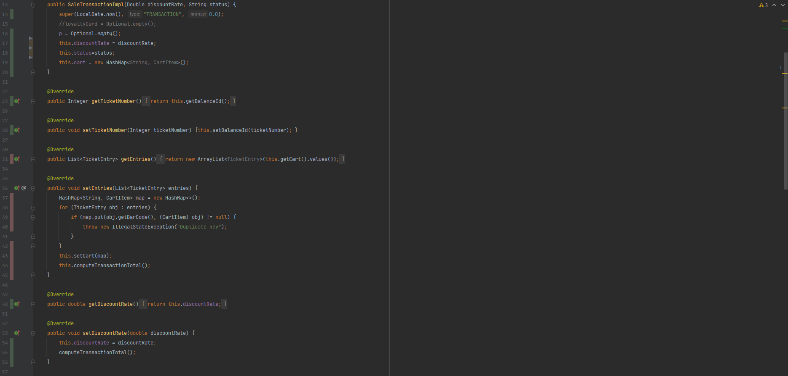

# Unit Testing Documentation

Authors: Rocco Luca Iamello, Massimo Di Natale, Paolo Trungadi, Riccardo Gracis

Date: 15/05/2021

Version: 1.00

# Contents

- [Black Box Unit Tests](#black-box-unit-tests)

- [White Box Unit Tests](#white-box-unit-tests)

# Black Box Unit Tests

    <Define here criteria, predicates and the combination of predicates for each function of each class.
    Define test cases to cover all equivalence classes and boundary conditions.
    In the table, report the description of the black box test case and (traceability) the correspondence with the JUnit test case writing the 
    class and method name that contains the test case>
    <JUnit test classes must be in src/test/java/it/polito/ezshop   You find here, and you can use,  class TestEzShops.java that is executed  
    to start tests
    >

 ### **Class *ProductTypeImpl* - method *validateDescr***

**Criteria for method *validateDescr*:**
	

 - String in a valid form (all chars allowed)

**Predicates for method *validateDescr*:**

| Criteria               | Predicate |
| ---------------------- | --------- |
| String in a valid form | Len >0    |
|                        | 0("")     |
|                        | NULL      |

**Boundaries**:

| Criteria               | Boundary values |
| ---------------------- | --------------- |
| String in a valid form | ""              |

**Combination of predicates**:

| String in a valid form | Valid / Invalid | Description of the test case | JUnit test case- Class: ProductTypeImplTestvalidateDescr |
|-------|-------|-------|-------|
|Len>0|Valid|String s1="ciao";  T1(s1;true) |testValidDescr()|
|Len=0|Invalid|String s2=""; T2(s2;false)|testEmptyDescr()|
|NULL|Invalid|T3(null;false)|testNullDescr()|

 ### **Class *ProductTypeImpl* - method *validateProdCode***

**Criteria for method *validateProdCode*:**
	

 - Validity of String parameter
 - Length of the string
 - String represents a well formed integer
 - String accepted by GS1  (https://www.gs1.org/services/check-digit-calculator)

**Predicates for method *validateProdCode*:**

| Criteria                                | Predicate    |
| --------------------------------------- | ------------ |
| Validity of String parameter            | Valid        |
|                                         | NULL         |
| Length of the string                    | >=12 && <=14 |
|                                         | <12          |
|                                         | >14          |
| String represents a well formed integer | Yes          |
|                                         | No           |
| String accepted by GS1                  | Yes          |
|                                         | No           |

**Boundaries**:

| Criteria             | Boundary values |
| -------------------- | --------------- |
| Length of the string | 0 (""), 12, 14  |

**Combination of predicates**:

| Validity of String parameter | Length of the string | String represents a well formed integer | String accepted by GS1 | Valid / Invalid | Description of the test case                             | JUnit test case - Class: ProductTypeImplTestvalidateProdCode |
| ---------------------------- | -------------------- | --------------------------------------- | ---------------------- | --------------- | -------------------------------------------------------- | ------------------------------------------------------------ |
| Valid                        | >=12 && <=14         | Yes                                     | Yes                    | Valid           | T1("234829476238";true); T2("57643947623857";true); | testBarCode12() testBarCode14()                         |
| *                            | *                    | *                                       | No                     | Invalid         | T3("1234567891023";false);                               | testBarCodeInvalid()                                         |
| *                            | *                    | No                                      | *                      | Invalid         | T4("90sf";false);                                        | testBarCodeAlpha()                                           |
| *                            | <12 (also 0)         | *                                       | *                      | Invalid         | T5("";false)                                             | testBarCodeEmpty()                                           |
| *                            | >14                  | *                                       | *                      | Invalid         | T6("098765432123456";false)                              | testBarCodeLong()                                            |
| NULL                         | *                    | *                                       | *                      | Invalid         | T7(null;false)                                           | testBarCodeNull()                                            |

 ### **Class *Position* - method *validatePosition***

**Criteria for method *validatePosition*:**
	

 - String in a valid format (<aisleNumber>-<rackAlphabeticIdentifier>-<levelNumber>)
 - Length of the String

**Predicates for method *validatePosition*:**

| Criteria                 | Predicate |
| ------------------------ | --------- |
| String in a valid format | Valid     |
|                          | Not Valid |
|                          | NULL      |
| Length of the String     | >0        |
|                          | 0 ("")    |

**Boundaries**:

| Criteria | Boundary values |
| -------- | --------------- |
|          |                 |
|          |                 |

**Combination of predicates**:

| String in a valid format | Length of the String | Valid / Invalid | Description of the test case                 | JUnit test case -  Class: PositionTestvalidatePosition |
| ------------------------ | -------------------- | --------------- | -------------------------------------------- | ----------------------------------------------------------- |
| Valid                    | >0                   | Valid           | T1("12-AB-8903";true)                        | testPositionValid()                                         |
| Not Valid                | *                    | Invalid         | T2("12AB-8903";false) T3("AB12B";false) | testPositionInvalid() testPositionNoDelim()            |
| NULL                     | *                    | Invalid         | T4(null;false)                               | testPositionNull()                                          |
| *                        | 0("")                | Invalid         | T5("";false)                                 | testPositionEmpty()                                         |

 ### **Class *JDBC* - method *insertProductType***

**Criteria for method *insertProductType*:**
	

 - Sign of Id
 - Validity of position
 - Validity of barcode
 - Validity of description
 - Sign of sellPrice
 - Sign of quantity
 - Sign of discountrate

**Predicates for method *insertProductType*:**

| Criteria                | Predicate    |
| ----------------------- | ------------ |
| Sign of Id              | >0           |
|                         | <=0          |
| Validity of position    | Valid        |
|                         | Not Valid    |
| Validity of barcode     | Valid        |
|                         | Not Valid    |
| Validity of description | Valid        |
|                         | Not Valid    |
| Sign of sellPrice       | >0           |
|                         | <=0          |
| Sign of quantity        | >=0          |
|                         | <0           |
| Sign of discountrate    | >=0 && <=100 |
|                         | <0           |
|                         | >100         |

**Boundaries**:

| Criteria             | Boundary values |
| -------------------- | --------------- |
| Sign of Id           | 0               |
| Sign of sellPrice    | 0               |
| Sign of quantity     | 0               |
| Sign of discountrate | 0,100           |

**Combination of predicates**:

| Sign of Id | Validity of position | Validity of barcode | Validity of description | Sign of sellPrice | Sign of quantity | Sign of discountrate | Valid / Invalid | Description of the test case                                 | JUnit test case - Class ProductTypeDbBBTests |
| ---------- | -------------------- | ------------------- | ----------------------- | ----------------- | ---------------- | -------------------- | --------------- | ------------------------------------------------------------ | ------------------------------------------------- |
| >0         | Valid                | Valid               | Valid                   | >0                | >=0              | >=0 && <=100         | Valid           | T1(5,"1-A-2","234829476238","ciao",10.00,0,80.0,"note1";void) | testInsertPT()                                    |
| *          | *                    | *                   | *                       | *                 | *                | <0                   | Invalid         | T2(5,"1-A-2","234829476238","ciao",2.00,10,-1.0,"note1";SQLException) | testInsertPTinvDR()                               |
| *          | *                    | *                   | *                       | *                 | *                | >100                 | Invalid         | T3(5,"1-A-2","234829476238","ciao",2.00,10,120.0,"note1";SQLException) | testInsertPTinvDR2()                              |
| *          | *                    | *                   | *                       | *                 | <0               | *                    | Invalid         | T4(5,"1-A-2","234829476238","ciao",2.00,-10,80.0,"note1";SQLException) | testInsertPTinvQTY()                              |
| *          | *                    | *                   | *                       | <=0               | *                | *                    | Invalid         | T5(5,"1-A-2","234829476238","ciao",-2.00,10,80.0,"note1";SQLException) T6(5,"1-A-2","234829476238","ciao",0.00,10,80.0,"note1";SQLException) | testInsertPTinvSP() testInsertPTinvSP2()     |
| *          | *                    | *                   | Not Valid               | *                 | *                | *                    |                 | Integration testing - Param is always considered as valid since is validated in API |                                                   |
| *          | *                    | Not Valid           | *                       | *                 | *                | *                    |                 | Integration testing - Param is always considered as valid since is validated in API |                                                   |
| *          | Not valid            | *                   | *                       | *                 | *                | *                    |                 | Integration testing - Param is always considered as valid since is validated in API |                                                   |
| <=0        | *                    | *                   | *                       | *                 | *                | *                    | Invalid         | T7(-55,"1-A-2","234829476238","ciao",10.00,10,80.0,"note1";SQLException) T8(0,"1-A-2","234829476238","ciao",10.00,10,80.0,"note1";SQLException) | testInsertPTinvID() testInsertPTinvID2()     |

 ### **Class *JDBC* - method *insertOrder***

**Criteria for method *insertOrder*:**
	

 - Sign of id
 - Sign of priceperunit
 - Sign of quantity
 - Other predicates refer to Integration Testing and they are validated in API, since caller of this method is only API

**Predicates for method *insertOrder*:**

| Criteria             | Predicate |
| -------------------- | --------- |
| Sign of id           | >0        |
|                      | <=0       |
| Sign of priceperunit | >0        |
|                      | <=0       |
| Sign of quantity     | >0        |
|                      | <=0       |

**Boundaries**:

| Criteria             | Boundary values |
| -------------------- | --------------- |
| Sign of id           | 0               |
| Sign of priceperunit | 0               |
| Sign of quantity     | 0               |

**Combination of predicates**:

| Sign of id | Sign of priceperunit | Sign of quantity | Valid / Invalid | Description of the test case                                 | JUnit test case  - Class OrderDbBBTests      |
| ---------- | -------------------- | ---------------- | --------------- | ------------------------------------------------------------ | ------------------------------------------------- |
| >0         | >0                   | >0               | valid           | T1(1,null,10.0,12,"PAYED","234829476238","2021-05-15","ORDER",-25.0,2;void) | testInsertOrd()                                   |
| *          | *                    | <=0              | invalid         | T2(1,null,10.0,-12,"PAYED","234829476238","2021-05-15","ORDER",-25.0,2;SQLException) T3(1,null,10.0,0,"PAYED","234829476238","2021-05-15","ORDER",-25.0,2;SQLException) | testInsertOrdInvQT() testInsertOrdInvQT2()   |
| *          | <=0                  | *                | invalid         | T4(1,null,-10.0,10,"PAYED","234829476238","2021-05-15","ORDER",-25.0,2;SQLException) T5(1,null,0.0,10,"PAYED","234829476238","2021-05-15","ORDER",-25.0,2;SQLException) | testInsertOrdInvPPU() testInsertOrdInvPPU2() |
| <=0        | *                    | *                | invalid         | T6(-1,null,10.0,10,"PAYED","234829476238","2021-05-15","ORDER",-25.0,2;SQLException) T7(0,null,10.0,10,"PAYED","234829476238","2021-05-15","ORDER",-25.0,2;SQLException) | testInsertOrdInvID() testInsertOrdInvID2()   |

 ### **Class *JDBC* - method *updateProductType***

**Criteria for method *updateProductType*:**
	

 - Sign of Id
 - Validity of position
 - Validity of barcode
 - Validity of description
 - Sign of sellPrice
 - Sign of quantity
 - Sign of discountrate

**Predicates for method *updateProductType*:**

| Criteria                | Predicate    |
| ----------------------- | ------------ |
| Sign of Id              | >0           |
|                         | <=0          |
| Validity of position    | Valid        |
|                         | Not Valid    |
| Validity of barcode     | Valid        |
|                         | Not Valid    |
| Validity of description | Valid        |
|                         | Not Valid    |
| Sign of sellPrice       | >0           |
|                         | <=0          |
| Sign of quantity        | >=0          |
|                         | <0           |
| Sign of discountrate    | >=0 && <=100 |
|                         | <0           |
|                         | >100         |

**Boundaries**:

| Criteria             | Boundary values |
| -------------------- | --------------- |
| Sign of Id           | 0               |
| Sign of sellPrice    | 0               |
| Sign of quantity     | 0               |
| Sign of discountrate | 0,100           |

**Combination of predicates**:

| Sign of Id | Validity of position | Validity of barcode | Validity of description | Sign of sellPrice | Sign of quantity | Sign of discountrate | Valid / Invalid | Description of the test case                                 | JUnit test case - Class ProductTypeDbBBTests |
| ---------- | -------------------- | ------------------- | ----------------------- | ----------------- | ---------------- | -------------------- | --------------- | ------------------------------------------------------------ | ------------------------------------------------- |
| >0         | Valid                | Valid               | Valid                   | >0                | >=0              | >=0 && <=100         | Valid           | T1(5,"1-A-2","234829476238","ciao",10.00,0,80,"note1";void)  | testUpdatePT()                                    |
| *          | *                    | *                   | *                       | *                 | *                | <0                   | Invalid         | T2(5,"1-A-2","234829476238","ciao",2.00,10,-1,"note1";SQLException) | testUpdatePTinvDR()                               |
| *          | *                    | *                   | *                       | *                 | *                | >100                 | Invalid         | T3(5,"1-A-2","234829476238","ciao",2.00,10,120,"note1";SQLException) | testUpdatePTinvDR2()                              |
| *          | *                    | *                   | *                       | *                 | <0               | *                    | Invalid         | T4(5,"1-A-2","234829476238","ciao",2.00,-10,80,"note1";SQLException) | testUpdatePTinvQTY()                              |
| *          | *                    | *                   | *                       | <=0               | *                | *                    | Invalid         | T5(5,"1-A-2","234829476238","ciao",-2.00,10,80,"note1";SQLException) T6(5,"1-A-2","234829476238","ciao",0.00,10,80,"note1";SQLException) | tesUpdatePTinvSP() tesUpdatePTinvSP2()       |
| *          | *                    | *                   | Not Valid               | *                 | *                | *                    |                 | Integration testing - Param is always considered as valid since is validated in API |                                                   |
| *          | *                    | Not Valid           | *                       | *                 | *                | *                    |                 | Integration testing - Param is always considered as valid since is validated in API |                                                   |
| *          | Not valid            | *                   | *                       | *                 | *                | *                    |                 | Integration testing - Param is always considered as valid since is validated in API |                                                   |
| <=0        | *                    | *                   | *                       | *                 | *                | *                    | Invalid         | T7(-55,"1-A-2","234829476238","ciao",10.00,10,80,"note1";SQLException) T8(0,"1-A-2","234829476238","ciao",10.00,10,80,"note1";SQLException) | testUpdatePTinvID() testUpdatePTinvID2()     |

 ### **Class *JDBC* - method *updateOrder***

**Criteria for method *updateOrder*:**
	

 - Sign of id
 - Sign of priceperunit
 - Sign of quantity
 - Other predicates refer to Integration Testing and they are validated in API, since caller of this method is only API

**Predicates for method *updateOrder*:**

| Criteria             | Predicate |
| -------------------- | --------- |
| Sign of id           | >0        |
|                      | <=0       |
| Sign of priceperunit | >0        |
|                      | <=0       |
| Sign of quantity     | >0        |
|                      | <=0       |

**Boundaries**:

| Criteria             | Boundary values |
| -------------------- | --------------- |
| Sign of id           | 0               |
| Sign of priceperunit | 0               |
| Sign of quantity     | 0               |

**Combination of predicates**:

| Sign of id | Sign of priceperunit | Sign of quantity | Valid / Invalid | Description of the test case                                 | JUnit test case - Class OrderDbBBTests       |
| ---------- | -------------------- | ---------------- | --------------- | ------------------------------------------------------------ | ------------------------------------------------- |
| >0         | >0                   | >0               | valid           | T1(1,null,10.0,12,"PAYED","234829476238";void)               | testUpdateOrd()                                   |
| *          | *                    | <=0              | invalid         | T2(1,null,10.0,-12,"PAYED","234829476238";SQLException) T3(1,null,10.0,0,"PAYED","234829476238";SQLException) | testUpdateOrdInvQT() testUpdateOrdInvQT2()   |
| *          | <=0                  | *                | invalid         | T4(1,null,-10.0,10,"PAYED","234829476238";SQLException) T5(1,null,0.0,10,"PAYED","234829476238";SQLException) | testUpdateOrdInvPPU() testUpdateOrdInvPPU2() |
| <=0        | *                    | *                | invalid         | T6(-1,null,10.0,10,"PAYED","234829476238";SQLException) T7(0,null,10.0,10,"PAYED","234829476238";SQLException) | testUpdateOrdInvID() testUpdateOrdInvID2()   |

  ### **Class *JDBC* - method *insertCustomerCard***

  **Criteria for method *insertCustomerCard*:**

 - Loyalty Card with same id already existing in db

**Predicates for method *insertCustomerCard*:**

| Criteria                                     | Predicate |
| -------------------------------------------- | --------- |
| Loyalty Card with same id already existing in db                      | Yes     |
|                                              | No      |

**Combination of predicates**:

| Loyalty Card with same id already existing in db | Valid / Invalid | Description of the test case | JUnit test case - Class LoyaltyCardInsertDbBBTests |
|:-------------|-------|-------|-------|
|Yes|Invalid| T1: JDBC.insertLoyaltyCard("1234567890", 0, false); JDBC.insertLoyaltyCard("1234567890", 0, false); -> SQLException |testInsertLoyaltyCardExisting()|
|No|Valid|T2: JDBC.insertLoyaltyCard("1234567890", 0, false); -> card correctly inserted|testInsertLoyaltyCardCorrect()|

  ### **Class *JDBC* - method *insertUser***

  **Criteria for method *insertUser*:**

 - User with same id already existing in db
 - User with same username already existing in db

**Predicates for method *insertUser*:**

| Criteria                                     | Predicate |
| -------------------------------------------- | --------- |
|  User with same id already existing in db | Yes     |
|                                              | No      |
|  User with same username already existing in db | Yes     |
|                                              | No      |

**Combination of predicates**:

| User id already existing in db | Username already existing in db | Valid / Invalid | Description of the test case | JUnit test case - Class UserInsertDbBBTests |
|:--|--|--|--|--|
|Yes|*|Invalid| T1: db.insertUser(1, "u1", "pwd1", "Administrator"); 		db.insertUser(1, "u2", "pwd1", "Administrator"); -> SQLException |testInsertUserExistingId()|
|No|Yes|Invalid|T2: db.insertUser(1, "u1", "pwd1", "Administrator"); 		db.insertUser(2, "u2", "pwd1", "Administrator"); -> SQLException|testInsertUserExistingUsername()|
|No|No|Valid|T2: db.insertUser(1, "u1", "pwd1", "Administrator"); -> user correctly inserted|testInsertUserCorrect()|

### **Class *UserImpl* - method *updateRole***

**Criteria for method *updateRole*:**
	

 - Validity of String parameter (not null)
 - String parameter among one of the possible values ('Administrator' - 'ShopManager' - 'Cashier')

**Predicates for method *updateRole*:**

| Criteria                                     | Predicate |
| -------------------------------------------- | --------- |
| Validity of String role                      | Valid     |
|                                              | NULL      |
| String role among one of the possible values | Yes       |
|                                              | No        |

**Combination of predicates**:

| Validity of String role | String role among one of the possible values | Valid / Invalid | Description of the test case | JUnit test case - Class UserImplTestUpdateRole |
|:------|-------|-------|-------|-------|
|Valid|Yes|Valid|T1("Administrator") T2("ShopManager") T3("Cashier") -> value correctly updated|UserImplTestUpdateRole.java - TestRoleCorrectValue|
|""|No|Invalid|T4("Admin"; InvalidRoleException) T5(""; InvalidRoleException)|UserImplTestUpdateRole.java - TestRoleWrongValue|
|NULL|*|Invalid|T6(NULL ; InvalidRoleException)|UserImplTestUpdateRole.java - TestNullRole|

### **Class _CreditCard_ - method _validate_**

**Criteria for method _validate_:**

- Validity of string parameter 
- CreditCard number follows the Luhn validation algorithm
- Lenght of string parameter (CreditCard Number)

- **Predicates for method _validate_:**

| Criteria                          | Predicate |
| --------------------------------- | --------- |
| Validity of string parameter      | Valid     |
|                                   | NULL      |
| Number follows the Luhn algorithm | Yes      |
|                                   | No     |
| Lenght of CreditCard number       |  <13   |
|                                   |  >=13 && <=19  |
|                                   |  >19   |

**Boundaries**:

Boundaries for method validateCreditCard:

| Criteria | Boundary values |
| -------- | --------------- |
| Lenght of CreditCard number | 13, 19 |

**Combination of predicates**:

Combination of predicates for method validateCreditCard

| Number follows the Luhn algorithm | Valid / Invalid | Lenght of the number | Description of the test case  | JUnit test case |
| --------------------------------- | --------------- | ------ | ----------------------------- | --------------- |
| false | Invalid | >=13 && <=19 | T1(4485370086510892) -> false | testCCValid()       |
| true | Valid | >=13 && <=19 | T2(4485370086510891) -> true  | testCCnotValid()       |
 

 ### **Class _JDBC_ - _addSaleTransactionDB()_**

**Criteria for method *_addSaleTransactionDB()_*:**
	

 - Sale transaction with same ID already exists in the table
 - SaleTransaction is NULL
 - Table existence

**Predicates for method _addSaleTransactionDB()_:**

| Criteria | Predicate |
| -------- | --------- |
|  Sale transaction already exists with same ID in the table        |    YES       |
|          |      NO     |
|    SaleTransaction passed is NULL      |    YES       |
|          |     NO      |
|     Table existence    |    YES       |
|          |     NO      |

**Combination of predicates**:

| Sale transaction with same ID already exists in the table  | SaleTransaction passed is NULL  | Table existence | Valid / Invalid | Description of the test case | JUnit test case |
| ---------- | --------------- | ---------------------------- | --------------- | ----------------- | -------------- |
|     YES       |       NO         |           YES                  |     Valid            | T1: _addSaleTransactionDB(sale)_ | _testAddSaleTransaction()_  |
|      NO     |       *        | *               |     Invalid            | T2: _addSaleTransactionDB(sale)_ -> throw new SQLException() | _testAddSaleTransaction_Error02()_  |
|      *      |     YES          |             *                 |   Invalid              |T3: _addSaleTransactionDB(null)_ -> throw new SQLException()| _testAddSaleTransaction_Error03()_  |
|      *      |           *      |                    NO          |     Invalid            | T4: _addSaleTransactionDB(sale)_ -> throw new SQLException() | __testAddSaleTransaction_Error01()_  |

### **Class _JDBC_ - _deleteSaleTransactionDB()_**

**Criteria for method *_deleteSaleTransactionDB()_*:**
	
 - Sale transaction with same ID exists in the table
 - SaleTransaction is NULL
 - Table existence

**Predicates for method _addSaleTransactionDB()_:**

| Criteria | Predicate |
| -------- | --------- |
|  Sale transaction exists with same ID in the table        |    YES       |
|          |      NO     |
|    SaleTransaction passed is NULL      |    YES       |
|          |     NO      |
|     Table existence    |    YES       |
|          |     NO      |

**Combination of predicates**:

| Sale transaction exists with same ID in the table  | SaleTransaction passed is NULL  | Table existence | Valid / Invalid | Description of the test case | JUnit test case |
| ---------- | --------------- | ---------------------------- | --------------- | ----------------- | -------------- |
|     *       |       NO         |           YES                  |     Valid            | T1: _deleteSaleTransactionDB(sale)_ | _testDeleteSaleTransaction()_   _testDeleteSaleTransaction_Error02()_ |
|      *      |     YES          |             *                 |   Invalid              |T2: _deleteSaleTransactionDB(null)_ -> throw new SQLException()| _testAddSaleTransaction_Error03()_  |
|      *      |           *      |                    NO          |     Invalid            | T3: _deleteSaleTransactionDB(sale)_ -> throw new SQLException() | _testAddSaleTransaction_Error01()_  |

### **Class *class_name* - method *name***

**Criteria for method *name*:**
	

 - 
 - 

**Predicates for method *name*:**

| Criteria | Predicate |
| -------- | --------- |
|          |           |
|          |           |
|          |           |
|          |           |

**Boundaries**:

| Criteria | Boundary values |
| -------- | --------------- |
|          |                 |
|          |                 |

**Combination of predicates**:

| Criteria 1 | Criteria 2 | ...  | Valid / Invalid | Description of the test case | JUnit test case |
| ---------- | ---------- | ---- | --------------- | ---------------------------- | --------------- |
|            |            |      |                 |                              |                 |
|            |            |      |                 |                              |                 |
|            |            |      |                 |                              |                 |
|            |            |      |                 |                              |                 |
|            |            |      |                 |                              |                 |

# White Box Unit Tests

### Test cases definition

    <JUnit test classes must be in src/test/java/it/polito/ezshop>
    <Report here all the created JUnit test cases, and the units/classes under test >
    <For traceability write the class and method name that contains the test case>

| Unit name | JUnit test case |
|--|--|
|ProductTypeImpl|Getters And Setters test cases - Class ProductTypeImplWBTests.java|
|ProductTypeImpl|testCoverageValidateBarcode() - Class ProductTypeImplWBTests.java|
|OrderImpl|Getters And Setters test cases - Class OrderImplWBTests.java|
|Position|Getters And Setters test cases - Class PositionWBTests.java|
|Position|testCoverageValidatePos() - Class PositionWBTests.java|
|JDBC|testCreatePosTable()  - Class: PositionDbWBTests|
|JDBC|testInsertPosTable()  - Class: PositionDbWBTests|
|JDBC|testDeletePosTable()  - Class: PositionDbWBTests|
|JDBC|testLoadPosTable()  - Class: PositionDbWBTests|
|JDBC|testLoadOrderTable()  - Class: PositionDbWBTests|
|JDBC|testLoadInventoryTable()  - Class: PositionDbWBTests|
|JDBC|testCreateLoyaltyCardTable() - Class: LoyaltyCardDbWBTests.java|
|JDBC|testDeleteLoyaltyCard()  - Class: LoyaltyCardDbWBTests.java|
|JDBC|testModifyPointsLoyaltyCard()  - Class: LoyaltyCardDbWBTests.java|
|JDBC|testLoadLoyaltyCards()  - Class: LoyaltyCardDbWBTests.java|
|JDBC|testCreateUserTable() - Class: UserDbWBTests.java|
|JDBC|testDeleteUser()  - Class: UserDbWBTests.java|
|JDBC|testLoadUsers()  - Class: UserDbWBTests.java|
|JDBC|testUpdateUserRole()  - Class: UserDbWBTests.java|
|JDBC|testCreateBalTable() - Class: BalanceDBTests.java|
|JDBC|testInsertBalTable() - Class: BalanceDBTests.java|
|JDBC|testUpdateBalTable() - Class: BalanceDBTests.java|
|JDBC|testLoadBal() - Class: BalanceDBTests.java|
|AccountBook|Getters and Setters test cases - Class AccountBookWBTests.java|
|BalanceOperationImpl|Getters and Setters test cases - Class BalanceOperationImplWBTests.java|
|CashPayment|Getters and Setters test cases - Class CashPaymentWBTests.java|
|CreditCard|Getters and Setters test cases - Class CreditCardWBTests.java|
|CreditCard|CreditCard Validation test cases - Class CreditCardWBTests.java|
|Payment|Getters and Setters test cases - Class PaymentWBTests.java|
|UserImpl|Getters and Setters test cases - Class UserImplWBTests.java|
|UserImpl|testCurrentRole() - Class UserImplWBTests.java|
|LoyaltyCard|Getters and Setters test cases - Class LoyaltyCardWBTests.java|
|LoyaltyCard|testDetach() - Class LoyaltyCardWBTests.java|
|LoyaltyCard|testModifyPointsOnCard() - Class LoyaltyCardWBTests.java|
|SaleTransaction| getSetDiscountRate() - Class SaleTransactionImplTestWB.java |
|SaleTransaction| getSetPrice() - Class SaleTransactionImplTestWB.java |
|SaleTransaction| getSetStatus() - Class SaleTransactionImplTestWB.java |
|SaleTransaction| getSetTicketNumber() - Class SaleTransactionImplTestWB.java |
|SaleTransaction| getSetDate() - Class SaleTransactionImplTestWB.java |
|SaleTransaction| getSetType() - Class SaleTransactionImplTestWB.java |
|SaleTransaction| computeEmptyCartTotal() - Class SaleTransactionImplTestWB.java |
|SaleTransaction| getEmptyCart() - Class SaleTransactionImplTestWB.java |
|SaleTransaction| getEmptyPayment() - Class SaleTransactionImplTestWB.java |
|Product|Getters test cases - Class ProductWBTests.java|
|Product|testValidateRFID() - Class ProductWBTests.java|
|||

### Code coverage report

    <Add here the screenshot report of the statement and branch coverage obtained using
    the Eclemma tool. >

#### Class OrderImpl - 95,5%

#### Class Position - 100%

#### Class ProductTypeImpl - 100%

#### Class UserImpl - 100%

#### Class LoyaltyCard - 100%

#### Class SaleTransaction - 70%
_Stats from JaCoCo (from unit white box testing):_ 
 - Class Coverage (100% - 1/1)
 - Method Coverage (70% - 14/20)
 - Line Coverage (54% - 27/50)
 - Branch Coverage (25% - 3/12)
  
_Coverage in code:_  

#### Class AccountBook - 7.8%
#### Class CreditCard - 37.8%
#### Class BalanceOperationImpl - 100%
#### Class CashPayment - 100%
#### Class Credit - 100%
#### Class CreditCardPayment - 100%
#### Class Debit - 100%
#### Class Payment - 100%

### Loop coverage analysis

    <Identify significant loops in the units and reports the test cases
    developed to cover zero, one or multiple iterations >

|Unit name | Loop rows | Number of iterations | JUnit test case |
|---|---|---|---|
|||||
|||||
||||||

